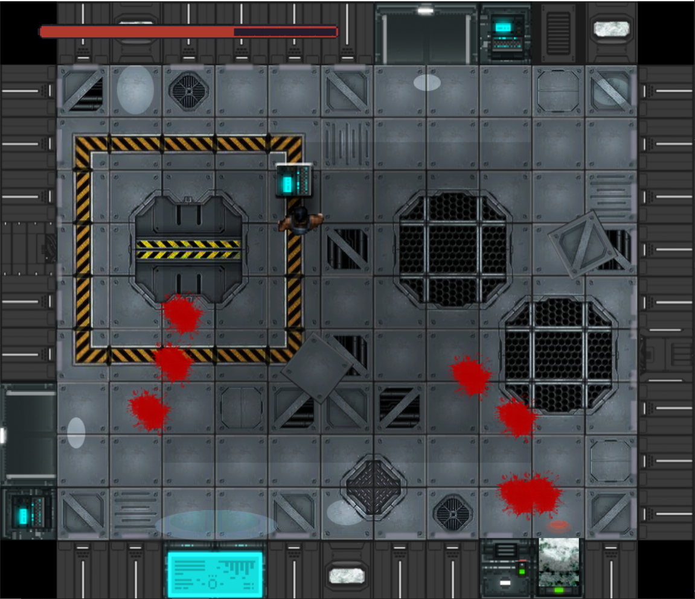

# Storm 51

To play the game you need to have python and install all the dependencies in the requirements.txt.

To install the dependenciesuse the following comand:
```bash
pip install -r requirements.txt
```

## How to play

You can use the "WASD" keys to shoot and the arrows to move. You can sprint pressing the SPACE bar.

If you manage to kill all monsters in the first level go to the computer in the main room and press SHIFT to take the elevator.




